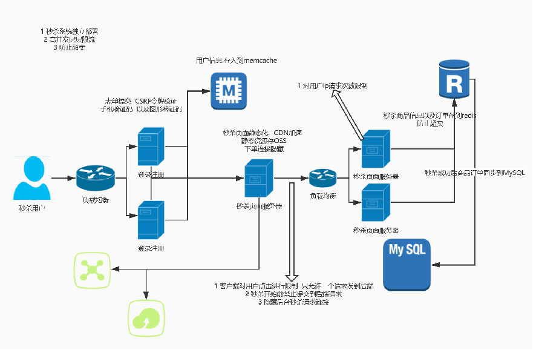

# 秒杀总结
### 1.项目架构


### 2.1 秒杀问题:
- 现有业务冲击
- 高流量大并发
- 网络带宽突增
- 超卖
- 防止黄牛

### 2.2 解决方案
- 单独部署
- 限流  熔断
- 缓存
- CDN+OSS
- 消息队列

### 3.环境
````
centos  7.6
php 7.2*
MySQL5.7*

redis  memcache

tp5.1
````
### 4.登录注册环节
路由
````
<?php
Route::get('/','index/Index/index');
Route::rule('login','user/Index/login','GET|POST');
Route::rule('register','user/Index/register','GET|POST');
`````
数据录配置文件``config/database.php``
````
return [
    // 数据库类型
    'type'            => 'mysql',
    // 服务器地址
    'hostname'        => '127.0.0.1',
    // 数据库名
    'database'        => 'shop',
    // 用户名
    'username'        => 'root',
    // 密码
    'password'        => 'root',
    // 端口
    'hostport'        => '3306',
````
修改session的存储方式``config/session.php``
````
return [
    'id'             => '',
    // SESSION_ID的提交变量,解决flash上传跨域
    'var_session_id' => '',
    // SESSION 前缀
    'prefix'         => 'think',
    // 驱动方式 支持redis memcache memcached
    'type'           => 'memcache',
    // 是否自动开启 SESSION
    'auto_start'     => true,
];
````
登录注册控制``application/user/controller/Index.php``
````
<?php

namespace app\user\controller;

use think\Controller;
use think\Request;
use think\Db;

class Index extends Controller{

	private $memcache;

	public function initialize(){
		$this->memcache = new \Memcache;
		$this->memcache->connect('127.0.0.1',11211);
	}

	public function login(Request $request){
		if($request->isPost()){
            $data = $request->param();

            $validate = new \app\user\validate\User();

            if(!$validate->check($data)){
                return $this->error($validate->getError());
            }

            $user['mobile'] = $request->param('mobile');
            $user['password'] = md5($request->param('password'));

			if($password = $this->memcache->get($user['mobile'])){
				if($password==$user['password']){
					//return redirect('/');
						return json(['msg'=>'登录成功']);
				}else{
					return $this->error('密码错误');
				}
			}

			$res = Db::name('user')->where('mobile',$user['mobile'])->find();
			if($res){
				
				if($res['password']==$user['password'] ){
					 session('mobile',$user['mobile']);
                     $this->memcache->set($user['mobile'],$user['password'] );				
					return redirect('/');
				}
			}else{
			    return $this->error('用户不存在');
			}
		}else{
			return view('login');
		}
	}
	public function register(Request $request){

		if($request->isPost()){
			$data = $request->param();

			$validate = new \app\user\validate\User();
		
			if(!$validate->check($data)){
				return $this->error($validate->getError());
			}		
			
			$user['mobile'] = $request->param('mobile');		
			$user['password'] = md5($request->param('password'));		
	
			$ret = Db::name('user')->where('mobile',$user['mobile'])->find();
			
			if($ret){
				return $this->error('用户已经存在');
			}			
			$res = Db::name('user')->insert($user);
			if($res){
				session('mobile',$user['mobile']);
				$this->memcache->set($user['mobile'],$user['password'] );			
				return $this->redirect('/');
			}
		}else{
			return view('register');
		}
	}
}
````
[验证器](https://www.kancloud.cn/manual/thinkphp5_1/354102)``application/user/validate/User.php``
````
<?php

namespace app\user\validate;

use think\Validate;

class User extends Validate
{
    /**
     * 定义验证规则
     * 格式：'字段名'	=>	['规则1','规则2'...]
     *
     * @var array
     */	
	protected $rule = [
		'mobile'=>'require|length:11',
		'password'=>'require|length:6,12'
	];
    
    /**
     * 定义错误信息
     * 格式：'字段名.规则名'	=>	'错误信息'
     *
     * @var array
     */	
    protected $message = [
		'mobile.require'=>'手机号必须输入',
		'mobile.length'=>'手机号必须11位',
		'password.require'=>'密码字段必须输入',
		'password.length'=>'密码长度6-12位'
	];
}
````
登录页面
````
<!DOCTYPE html>
<html lang="zh-CN">
<head>
<meta charset="utf-8">
<title>秒杀用户登录</title>
<link rel="stylesheet" href="/static/css/style.css">
</head>

<body>
    <div class="content">
        <div class="form sign-in">
            <h2>秒杀用户登录</h2>
			<form action="login" method="post">
				 <label>
                    <span>用户名</span>
                    <input type="text" name="mobile" />
                </label>
                <label>
                    <span>密码</span>
                    <input type="password" name="password" />
                </label>
                <button type="submit" class="submit">登 录</button>
			</form>
        </div>
    </div>
</body>

</html>
````
注册页面
````
<!DOCTYPE html>
<html lang="zh-CN">
<head>
<meta charset="utf-8">
<title>秒杀-用户注册</title>
<link rel="stylesheet" href="/static/css/style.css">
</head>
<body>
    <div class="content">
        <div class="form sign-in">
            <h2>秒杀-用户注册</h2>
			<form action="register" method="post">
				<label>
                    <span>用户名</span>
                    <input type="text" name="mobile" />
                </label>
                <label>
                    <span>密码</span>
                    <input type="password" name="password" />
                </label>
                <button type="submit" class="submit">注册</button>
			</form>
        </div>
    </div>
</body>

</html>
````

### 5.安全措施
- 表单提交添加令牌token
- 表单提交加入手机验证码
- 图形验证码
- 限制ip访问  
- 登录  做负载均衡  用户登录存入memcache

模拟机器人批量请求访问
````
<?php

function curl_post($url,$data,$cookie=null,$cookie_file=null){
    $ch = curl_init();
    curl_setopt($ch, CURLOPT_URL, $url);
    curl_setopt($ch, CURLOPT_RETURNTRANSFER, 1);
    curl_setopt($ch, CURLOPT_SSL_VERIFYPEER, FALSE);
    curl_setopt($ch, CURLOPT_SSL_VERIFYHOST, FALSE);
    curl_setopt($ch, CURLOPT_POST, 1);
        if($cookie){
        curl_setopt($ch, CURLOPT_COOKIEJAR, $cookie);
        }

        if($cookie_file){
                curl_setopt($ch, CURLOPT_COOKIEFILE, $cookie_file);
        }
    curl_setopt($ch, CURLOPT_POSTFIELDS, $data);
    $output = curl_exec($ch);
    curl_close($ch);
    return $output;
}

//模拟批量注册
//for($i=0;$i<11;$i++){
//$url = 'http://www.willyin.vip/register';

//$mobile = '13888888'.rand(100,999);

//$data = ['mobile'=>$mobile,'password'=>'123456'];

//$res = curl_post($url,$data,$mobile);

//var_dump($res);
//}


//模拟登录
$url = 'http://www.willyin.vip/login';

$data = ['mobile'=>'13888888123','password'=>'123456'];

$res = curl_post($url,$data,null,'cookie.txt');
//打印出成功的消息(展示成功的界面)
var_dump($res);
````
解决办法
- 加入手机验证码
- 加入token校验
````
登录注册同理:
<form action="register" method="post">
        {:token()}
				<label>
                    <span>用户名</span>
                    <input type="text" name="mobile" />
                </label>
                <label>
                    <span>密码</span>
                    <input type="password" name="password" />
                </label>
                <button type="submit" class="submit">注册</button>
			</form>


并修改校验器:
protected $rule = [
		'mobile'=>'require|length:11|token',
		'password'=>'require|length:6,12'
	];
````
- 限制ip
>可以使用redis记录同一ip下用户的注册数量,当IP数量超过预期值,就可以禁用

### 登录验证以及退出
路由
````
Route::get('/','index/Index/index')->middleware('Login');
Route::rule('login','user/Index/login','GET|POST');
Route::rule('register','user/Index/register','GET|POST');
Route::get('logout','user/Index/logout');
````
中间件
````
<?php
namespace app\http\middleware;
class Login
{
    public function handle($request, \Closure $next)
    {
		if(!session('mobile')){
			return redirect('/login');
		}
		return $next($request);
    }
}
````
控制器
````
use think\Controller;
use think\Request;
use think\Db;

class Index extends Controller{

	private $memcache;

	public function initialize(){
		$this->memcache = new \Memcache;
		$this->memcache->connect('127.0.0.1',11211);
	}

	public function logout(){
		session('mobile',null);
		return redirect('/login');
	}
            ........................
````


