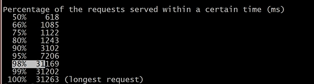
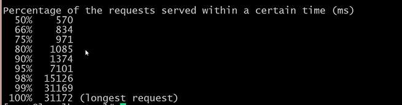
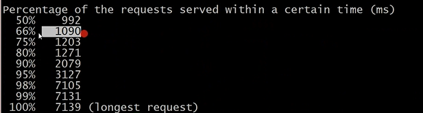
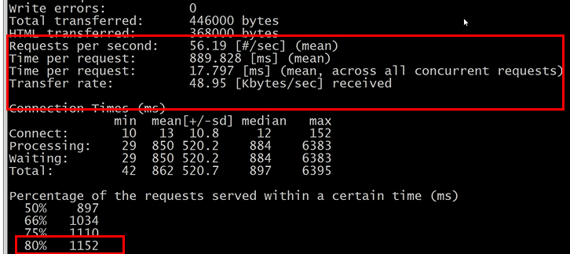
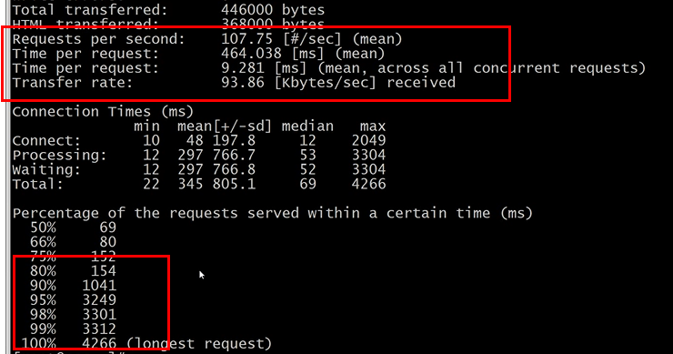
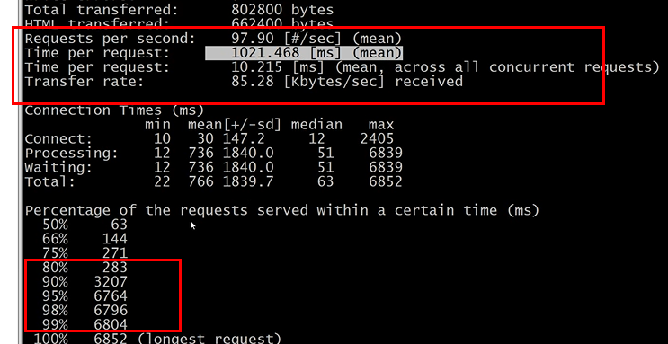
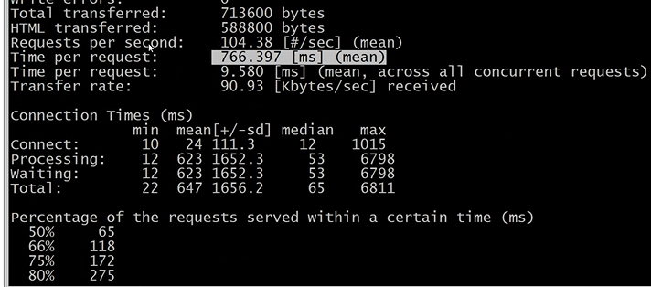
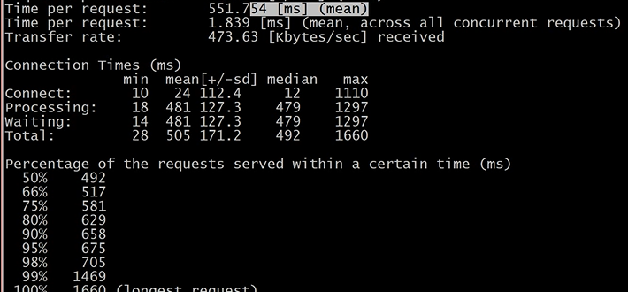

# 压力测试
工具 : ``ab  或者 jmeter``

这里采用ab

安装
````
yum -y install httpd

yum -y install httpd-tools
````
使用方式
````
ab -c 10 -n 100   url

-c 10 表示并发用户数为 10

-n 100 表示请求总数为 100,一定大于用户数量

ab -c 10 -n 100 www.baidu.com
````

### 影响并发速度的原因

- 服务器的带宽
- cup的性能
- 内存大小
- 代码的质量

----
####  服务器是 1核 1G 1M带宽
这里是 1核 1G 1M带宽 的 虚拟机 进行测试
````
ab -c 30 -n 100 http://willyin.com 

这里可以接受的结果
````


````
ab -c 30 -n 200 http://willyin.com 

现在就不是很理想
````


````
ab -c 50 -n 200 http://willyin.com 
````


则合理范围在
````
ab -c 20 -n 100 http://willyin.com 
````

出现这个原因是你进行测试的服务器的cup配置过低

更换成为 2核 4G 的 同一 服务器进行测试
````
ab -c 50 -n 500 http://willyin.com 

这个结果更接近于真实数据
````


---
### 压力测试之 [php配置性能优化](https://www.cnblogs.com/66w66/p/12944203.html)
配置文件中添加
````
linux下:
[opcache]
zend_extension=opcache.so
opcache.enable=1
opcache.enable_cli=1

windows下:
zend_extension = php_opcache.dll
opcache.enable=1
opcache.enable_cli=1
````
重启php-fpm

````
ab -c 50 -n 500 http://willyin.com 
````


以为提示了每秒中可以接受并发为100,从新测试
````
ab -c 100 -n 900 http://willyin.com 
````


有些困难,减少并发数量
````
ab -c 80 -n 900 http://willyin.com 
````


并发也就在80~100之间

发现cpu没有达到80%,并发数没有达到提示的最大值,但是访问速度很慢,那就一定是``带宽问题``

可以到阿里云中进行带宽升级,查看对比,最低是是3小时,5M带宽,0.5元左右

此时测试
````
ab -c 500 -n 2000 http://willyin.com 
````


性能大幅度提升

但是此时要看cpu,如果到达了80%以上,就不在建议增加访问量

#### 在更改了配置 1核 1G 5M带宽 可以达到 500并发(页面特别简单)


