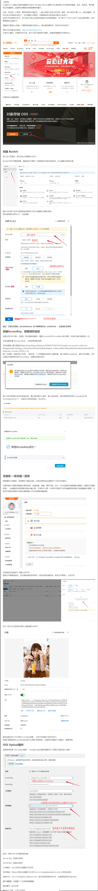
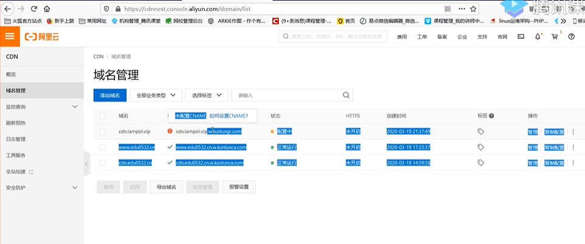
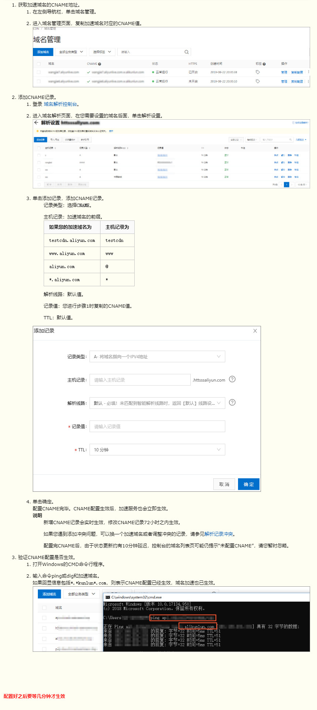
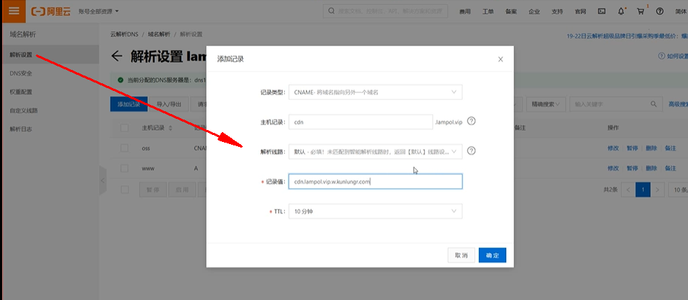

# 页面静态资源oss及cdn缓存秒杀页面

### [oss](https://blog.csdn.net/qoozz/article/details/104083031)
将 js文件 , css文件 , img 等静态文件放入阿里云的oss中 



### [CDN](https://help.aliyun.com/document_detail/27144.html)







### 当配置完成发现没有生效,需要对框架进行配置
````
tp5  配置cdn
入口文件添加  public/index.php

session_cache_limiter('public');
````

### 压测问题
>当配置了cdn后的压测意义不大,因为此时就是根据你的位置在指定的cdn上进行的单点测试


### 未校验直接登录问题
因为配置了cdn,所有的页面都在cdn缓存中,就可以不直接登录就如首页
>因为实际的业务是,秒杀的部分是要和实际的业务逻辑部分分离开的,直接修改下框架,删除``session_cache_limiter('public');``
