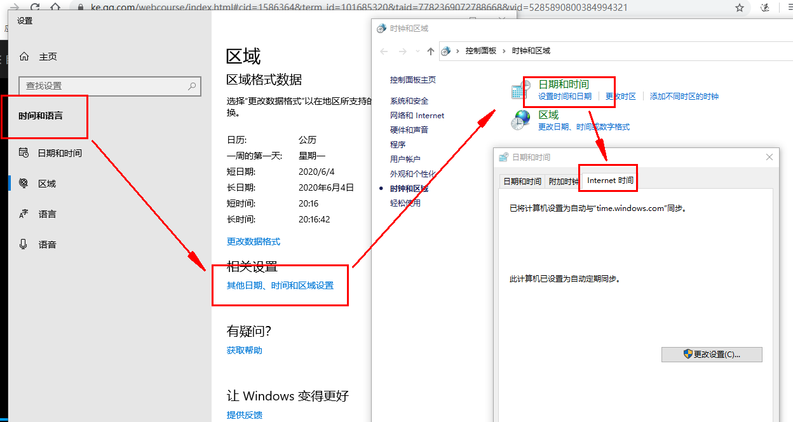
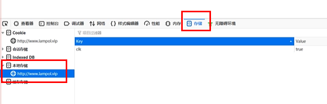

# 秒杀倒计时
````

使用客户端时间:不准,并且用户可以手动更改秒杀的时间

从服务端获取时间:服务器可能会有波动,或者造成一定的压力

网络环境 :秒杀功能是有算法的,可能与浏览器/手机性能或者无关
````
服务端时间校正
````
1.yum install ntpdate -y
2.ntpdate   time.windows.com  //time.windows.com 相当于一个时间服务器,是windows的
````

````
但是注意他都是有一定的时间的偏移量
解决办法就是每隔一段时间进行更新以下ntpdate time.windows.com 
````


#### 代码实现
路由:
````
Route::get('getTime','index/Index/getTime');//->middleware('Login');
````
控制器
````
namespace app\index\controller;

use think\Request;
use think\Controller;

class Index extends Controller{
  //开始的时间戳
  private $start_time = 1585037864;
  public function getTime(){
 		$time = $this->start_time-time();
 		return json(['time'=>$time]);	
 	}
}
````
展示页
````
<!DOCTYPE html>
<html lang="zh-CN">
<head>
	<meta charset="utf-8">
	<title>秒杀</title>

	<link href="http://cdn.lampol.vip/css/timeTo.css" type="text/css" rel="stylesheet"/>
	<script src="http://cdn.lampol.vip/js/jquery.time-to.min.js"></script>


	<link href="http://cdn.lampol.vip/css/style.css" type="text/css" rel="stylesheet"/>
	<script src="http://cdn.lampol.vip/js/jquery.min.js"></script>

</head>

<body>
	<div id="box">
		
	</div>
	
	<div  class="countdown" id="countdown"></div>
</body>

<script>
$.get('getTime',function(res){
   //获取剩余时间		
	tt=res.time;
   //时间为0,倒计时停止
	if(tt<0){
    	tt='stop';
	}

	$('#countdown').timeTo(tt,function(){
    	$('#ms').append('');
	});

})
````

# 秒杀地址后台接口隐藏
>秒杀页面中如果商品秒杀链接要是提前暴露出去可能有人直接访问url就提前秒杀了

解决办法:
>秒杀前 先请求一个接口  根据规则生成一个地址，地址存到后端
然后返回给前端  前端再去请求后端  
后端根据获取到地址进行比对 成功可以进入秒杀

### 代码事项
路由:
````
Route::get('getPath','index/Index/getPath');//->middleware('Login');
````
控制器:
````
<?php
namespace app\index\controller;

use think\Request;
use think\Controller;

class Index extends Controller{

	private $start_time = 1585037864;
	private $redis;

	public function initialize (){
		$this->redis = new \Redis();
		$this->redis->connect('127.0.0.1',6379);	
	}

    public function index()
    {
		return view('index');
    }
	public function getTime(){
		if(!session('mobile')){
			return json(['status'=>'fail','msg'=>'先去登录']);;
		}
		$time = $this->start_time-time();
		return json(['time'=>$time]);	
	}

	public function getPath(Request  $request){

		if(!session('mobile')){
            return json(['status'=>'fail','msg'=>'先去登录']);
        }
		$url = md5(session('mobile').$request->param('id'));
		// 这个地方 把地址 存到redis
		return json(['status'=>'success','url'=>$url]);	
	}
}
````
展示页:
````
<!DOCTYPE html>
<html lang="zh-CN">
<head>
	<meta charset="utf-8">
	<title>秒杀</title>
	<link href="http://cdn.lampol.vip/css/timeTo.css" type="text/css" rel="stylesheet"/>
	<link href="http://cdn.lampol.vip/css/style.css" type="text/css" rel="stylesheet"/>
	<script src="http://cdn.lampol.vip/js/jquery.min.js"></script>
	<script src="http://cdn.lampol.vip/js/jquery.time-to.min.js"></script>
</head>

<body>
	<div id="box">
		
		<div id="ms"> </div>
	</div>

	<div  class="countdown" id="countdown"></div>
</body>

<script>

$.get('getTime',function(res){

	if(res.status=='fail'){
		alert(res.msg);
		return;
	}

	tt=res.time;

	if(tt<0){
    	tt='stop';
	}
	$('#countdown').timeTo(tt,function(){
    	$('#ms').append('');
	});

})

$('#ms').on('click','img',function(){
		$.get('getPath',{id:1},function(res){
			if(res.status=='success'){
				//这里开始请求  秒杀接口  带着 res.url
				console.log(res.url);
			}
		});
});
</script>
</html>
````
这里的redis中存储的方式会与用户信息有关,稍后处理

# 前端请求限流
>防刷 限流

前端限流:
>用户只能点击一次抢购按钮

### 代码复现
前端请求页面
````
<!DOCTYPE html>
<html lang="zh-CN">
<head>
	<meta charset="utf-8">
	<title>秒杀</title>
	<link href="http://cdn.lampol.vip/css/timeTo.css" type="text/css" rel="stylesheet"/>
	<link href="http://cdn.lampol.vip/css/style.css" type="text/css" rel="stylesheet"/>
	<script src="http://cdn.lampol.vip/js/jquery.min.js"></script>
	<script src="http://cdn.lampol.vip/js/jquery.time-to.min.js"></script>
</head>

<body>
	<div id="box">
		
		<div id="ms"> </div>
	</div>

	<div  class="countdown" id="countdown"></div>
</body>

<script>

$.get('getTime',function(res){

	if(res.status=='fail'){
		alert(res.msg);
		return;
	}

	tt=5;

	if(tt<0){
    	tt='stop';
	}

	$('#countdown').timeTo(tt,function(){
    	$('#ms').append('');
	});

})

$('#ms').on('click','img',function(){
	if(localStorage.getItem('clk')==null){
		console.log('start');	
		localStorage.setItem('clk',true);

		$.get('getPath',{id:1},function(res){
			if(res.status=='success'){
				//这里开始请求  秒杀接口  带着 res.url
				console.log(res.url);
			}
		});

	}else{
		$('#ms').html('');
		alert('您已经参与了抢购');	
	}

});

</script>
</html>

````




后端限流
>Nginx、接口进行限流。
>
>Nginx是粒度最大的一层，这层的频度设置我们需要谨慎操作，这里将影响我们整个网站访问，Nginx层的频度设置应该在我们应用服务器宕机阀值之下


接口限流
>控制 ip 访问次数

````
<?php
namespace app\index\controller;

use think\Request;
use think\Controller;

class Index extends Controller{

	private $start_time = 1585037864;
	private $redis;

	public function initialize (){
		$this->redis = new \Redis();
		$this->redis->connect('127.0.0.1',6379);	
	}
    public function getPath(Request  $request){
    
            if(!session('mobile')){
                return json(['status'=>'fail','msg'=>'先去登录']);
            }
    
            $ip = $request->server()['HTTP_X_FORWARDED_FOR'];
        
            if($this->redis->exists($ip)){
                if($this->redis->get($ip)>2){
                    return json(['status'=>'fail','msg'=>'ip请求过多']);
                }			
                $this->redis->incr($ip);
            }else{		
                $this->redis->set($ip,1);		
            }
            $url = md5(session('mobile').$request->param('id'));
            
            // 这个地方 把地址 存到redis
            return json(['status'=>'success','url'=>$url]);	
        }
}
````


