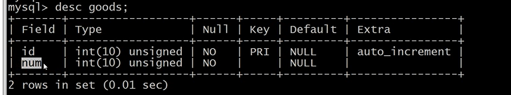

# 秒杀一般思路业务实现
## 遗留问题处理
>上节讲的请求秒杀地址时,没有对时间进行限制,只是限制了ip的访问次数
````
public function getPath(Request  $request){
    
            if(!session('mobile')){
                return json(['status'=>'fail','msg'=>'先去登录']);
            }
    
            $ip = $request->server()['HTTP_X_FORWARDED_FOR'];
        
            if($this->redis->exists($ip)){
                if($this->redis->get($ip)>2){
                    return json(['status'=>'fail','msg'=>'ip请求过多']);
                }			
                $this->redis->incr($ip);
            }else{		
                $this->redis->set($ip,1);		
            }
            $url = md5(session('mobile').$request->param('id'));
            
            // 这个地方 把地址 存到redis
            return json(['status'=>'success','url'=>$url]);	
        }
````
处理:
````
public function getPath(Request  $request){
    //登录限制
    if(!session('mobile')){
       return json(['status'=>'fail','msg'=>'先去登录']);
    }

   //时间未到,ip请求限制
    $now_time = time();
    if($now_time<$this->start_time){
      return json(['status'=>'fail','msg'=>'秒杀还没有开始']);
    }


    $ip = $request->server()['HTTP_X_FORWARDED_FOR'];

    if($this->redis->exists($ip)){
        if($this->redis->get($ip)>2){
            return json(['status'=>'fail','msg'=>'ip请求过多']);
        }			
        $this->redis->incr($ip);
    }else{		
        $this->redis->set($ip,1);		
    }
    $url = md5(session('mobile').$request->param('id'));
    
    // 这个地方 把地址 存到redis
    return json(['status'=>'success','url'=>$url]);	
}
````


## 关于上节redis存储访问地址问题
````
public
function getPath(Request $request) {

	if (!session('mobile')) {
		return json(['status' = >'fail', 'msg' = >'先去登录']);
	}
	$now_time = time();
	if ($now_time < $this - >start_time) {
		return json(['status' = >'fail', 'msg' = >'秒杀还没有开始']);
	}

	$ip = $request - >server()['HTTP_X_FORWARDED_FOR'];

	if ($this - >redis - >exists($ip)) {
		if ($this - >redis - >get($ip) > 2) {
			return json(['status' = >'fail', 'msg' = >'ip请求过多']);
		}
		$this - >redis - >incr($ip);
	} else {
		$this - >redis - >set($ip, 1);
	}

	//关于访问地址的的存储问题
	$url = md5(session('mobile').$request - >param('id'));
	$this - >redis - >set($url, 1); //1 为未访问  0访问 	
	// 这个地方 把地址 存到redis
	return json(['status' = >'success', 'url' = >$url]);
}
````
## redis存储访问参数的验证配置
显示层代码:
````
$('#ms').on('click','img',function(){
	if(localStorage.getItem('clk')==null){
		console.log('start');	
		localStorage.setItem('clk',true);

		$.get('getPath',{id:1},function(res){
			if(res.status=='success'){
				//这里开始请求  秒杀接口  带着 res.url
				$.get('/go/'+res.url+'/order/',{id:1},function(res){
						if(res.status=='success'){
							alert(res.msg);
						}else{
							alert(res.msg);
						}
				});
			}
		});
	}else{
		$('#ms').html('');
		alert('您已参与活动');
	}
});
````
路由:
````
Route::get('go/:url/order','index/Index/order');//->middleware('Login');
````
控制器:
````
public function order(Request $request){
		$url = $request->param('url');
		$id = $request->param('id');
		//http://www.lampol.vip/go/905635236f688eb6f0725a9512ced822/order/?id=1
		//echo $url.'===='.$id;

if(!$this->redis->exists($url)){
			return json(['status'=>'fail','msg'=>'请求地址不合法']);
		}
		
		if(!$this->redis->get($url)){
			return json(['status'=>'fail','msg'=>'秒杀已经参加过了吧']);
		}		
		$this->redis->set($url,0);				
		
		//  实际业务处理  .......
}
````

## 常规思路实现秒杀业务
这里简单的设计商品表



简单的设计订单表


显示页点代码:
````
<!DOCTYPE html>
<html lang="zh-CN">
<head>
	<meta charset="utf-8">
	<title>秒杀</title>
	<link href="http://cdn.lampol.vip/css/timeTo.css" type="text/css" rel="stylesheet"/>
	<link href="http://cdn.lampol.vip/css/style.css" type="text/css" rel="stylesheet"/>
	<script src="http://cdn.lampol.vip/js/jquery.min.js"></script>
	<script src="http://cdn.lampol.vip/js/jquery.time-to.min.js"></script>
</head>

<body>
	<div id="box">
		
		<div id="ms"> </div>
	</div>
	
	<div  class="countdown" id="countdown"></div>
</body>

<script>

$.get('getTime',function(res){
		
	if(res.status=='fail'){
		alert(res.msg);
		return;
	}
	tt = res.time;	

	if(tt<0){
    	tt='stop';
	}


	$('#countdown').timeTo(tt,function(){
    	$('#ms').append('');
	});

})

$('#ms').on('click','img',function(){
	if(localStorage.getItem('clk')==null){
		console.log('start');	
		localStorage.setItem('clk',true);

		$.get('getPath',{id:1},function(res){
			if(res.status=='success'){
				//这里开始请求  秒杀接口  带着 res.url
				$.get('/go/'+res.url+'/order/',{id:1},function(res){
						if(res.status=='success'){
							alert(res.msg);
						}else{
							alert(res.msg);
						}
				});
			}
		});
	}else{
		$('#ms').html('');
		alert('您已参与活动');
	}
});
</script>
</html>

````

路由:
````
Route::get('/','index/Index/index');//->middleware('Login');
Route::get('getTime','index/Index/getTime');//->middleware('Login');
Route::get('getPath','index/Index/getPath');//->middleware('Login');
Route::get('go/:url/order','index/Index/order');//->middleware('Login');
Route::rule('login','user/Index/login','GET|POST');
Route::rule('register','user/Index/register','GET|POST');
Route::get('logout','user/Index/logout');
````
控制器代码:
````
<?php
namespace app\index\controller;

use think\Request;
use think\Controller;
use think\Db;

class Index extends Controller{

	private $start_time = 1585298703;
	private $redis;

	public function initialize (){
		$this->redis = new \Redis();
		$this->redis->connect('127.0.0.1',6379);	
	}

    public function index()
    {
		return view('index');
    }
	public function getTime(){
	//	if(!session('mobile')){
	//		return json(['status'=>'fail','msg'=>'先去登录']);;
	//	}
		$time = $this->start_time-time();
		return json(['time'=>$time]);	
	}


	public function getPath(Request  $request){

		if(!session('mobile')){
            return json(['status'=>'fail','msg'=>'先去登录']);
        }
		$now_time = time();
		if($now_time<$this->start_time){
			return json(['status'=>'fail','msg'=>'秒杀还没有开始']);
		}

		$ip = $request->server()['HTTP_X_FORWARDED_FOR'];
	
		if($this->redis->exists($ip)){
			if($this->redis->get($ip)>2){
				return json(['status'=>'fail','msg'=>'ip请求过多']);
			}			
			$this->redis->incr($ip);
		}else{		
			$this->redis->set($ip,1);		
		}
		$url = md5(session('mobile').$request->param('id'));
		
		$this->redis->set($url,1);  //1 为未访问  0访问 	
		// 这个地方 把地址 存到redis
		return json(['status'=>'success','url'=>$url]);	
	}

	public function order(Request $request){
		$url = $request->param('url');
		$id = $request->param('id');
		//http://www.lampol.vip/go/905635236f688eb6f0725a9512ced822/order/?id=1
		//echo $url.'===='.$id;
		
		if(!$this->redis->exists($url)){
			return json(['status'=>'fail','msg'=>'请求地址不合法']);
		}
		
		if(!$this->redis->get($url)){
			return json(['status'=>'fail','msg'=>'秒杀已经参加过了吧']);
		}		
		$this->redis->set($url,0);				
		
		//  实际业务处理
	
		$num = Db::name('goods')->where('id',$id)->value('num'); 		

		if($num<=0){
			return json(['status'=>'fail','msg'=>'秒杀失败']);
		}
		
		$res = Db::name('goods')->where('id',$id)->setDec('num');		
	
		$mobile = session('mobile');		

		if($res){
			Db::name('orders')->insert(['mobile'=>$mobile,'goods_id'=>$id]);
			return json(['status'=>'success','msg'=>'秒杀成功']);
		}	
	}	
}

````
常规思路存在的问题:
>这里应该增加一个商品是否再秒杀活动中的判断
````
                //  实际业务处理
                    
                //商品是否再秒杀活动的判断 ...
                //查询下数据库(给秒杀商品一个特殊的标识)
                  ..........

		$num = Db::name('goods')->where('id',$id)->value('num'); 		

		if($num<=0){
			return json(['status'=>'fail','msg'=>'秒杀失败']);
		}

if($res){

                   //增加一个用户只能秒杀一次的判断
                
                   ...............


			Db::name('orders')->insert(['mobile'=>$mobile,'goods_id'=>$id]);
			return json(['status'=>'success','msg'=>'秒杀成功']);
		}
````
以及一些超买超卖的问题

mysql的并发数量的问题(mysql并发在1000左右)