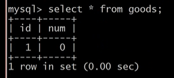
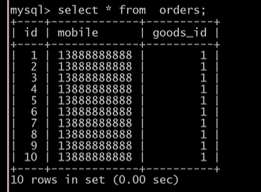
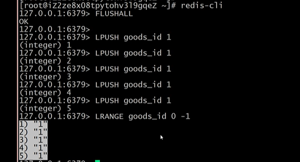
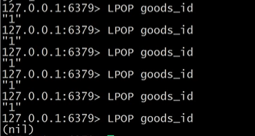
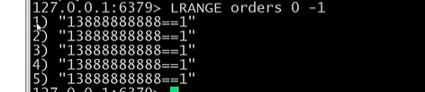
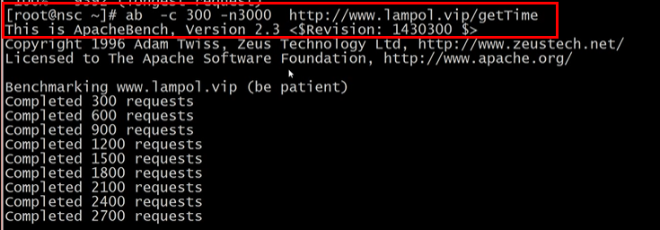
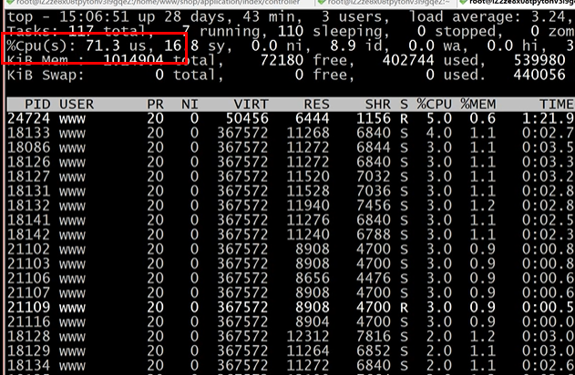
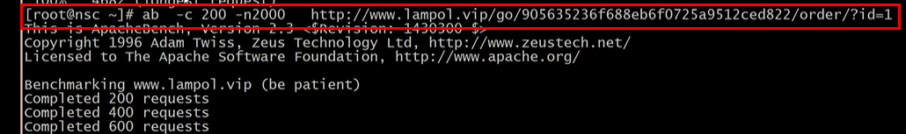
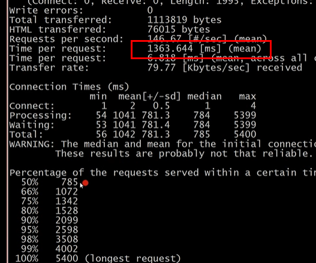

# 秒杀实战之高并发超卖解决方案
## Mysql方式处理秒杀的队列
解决问题的方式:
>通过事务的方式,利用写操作自动加入的排他锁,解决超卖的问题,让写的操作前置,但是注意你的事物隔离级别一定是[RR级别](https://m.weibo.cn/status/4484672878342006?)的

提前准备好商品的参数表(这里简单的存储了两个字段)



对于完成的用户从新存储数据(这里也是简单的使用了两个字段存储信息)




````
public function order(Request $request){
		//$url = $request->param('url');
		$id = $request->param('id');
		
		//if(!$this->redis->exists($url)){
		//	return json(['status'=>'fail','msg'=>'请求地址不合法']);
		//}
		
		//if(!$this->redis->get($url)){
		//	return json(['status'=>'fail','msg'=>'秒杀已经参加过了吧']);
		//}		
		//$this->redis->set($url,0);				
		
		//$mobile = session('mobile');		
		$mobile = '13888888888';

		//  mysql实际业务处理
		
		try{	
			Db::startTrans();
			$res = Db::name('goods')->where('id',$id)->setDec('num');
			$num = Db::name('goods')->where('id',$id)->value('num'); 		
	
			if($num<0){
				return json(['status'=>'fail','msg'=>'秒杀失败']);
			}
			
			//$res = Db::name('goods')->where('id',$id)->setDec('num');		
			// $res = Db::name('orders')->insert(['mobile'=>$mobile,'goods_id'=>$id]);
		
			//$res = Db::name('goods')->where('id',$id)->setDec('num');
	
			if($res){
			  //  Db::name('goods')->where('id',$id)->setDec('num');		
				Db::name('orders')->insert(['mobile'=>$mobile,'goods_id'=>$id]);
				Db::commit();
				return json(['status'=>'success','msg'=>'秒杀成功']);
			}
	
		}catch(\Exception $e){
			Db::rollback();
		}
}
````
存在的问题:
- 就是并发效果不好,应为mysql能够承受的最大的并发1K左右
- 通过排他锁的方式,所用的并行请求全部变成了串行换的顺序请求

## Redis方式处理秒杀的队列
加入要秒杀的商品是5个,提前在队列中存储5个



利用它lpop多此为空的特性



将秒杀后的信息存储在新的队列中



````
public function order(Request $request){
		//$url = $request->param('url');
		$id = $request->param('id');
		
		//if(!$this->redis->exists($url)){
		//	return json(['status'=>'fail','msg'=>'请求地址不合法']);
		//}
		
		//if(!$this->redis->get($url)){
		//	return json(['status'=>'fail','msg'=>'秒杀已经参加过了吧']);
		//}		
		//$this->redis->set($url,0);				
		
		//$mobile = session('mobile');		
		$mobile = '13888888888';
		
                //redis实际业务处理

                 $goods_id = $this->redis->lpop('goods_id');
            
            if($goods_id){
                $this->redis->lpush('orders',$mobile.'=='.$goods_id);
                return json(['status'=>'success','msg'=>'秒杀成功']);
            }else{
                return json(['status'=>'fail','msg'=>'秒杀失败']);
            }
        }  
````

## mysql && redis 代码的压力测试对比
这里是 1核 1G 5M 带块的性能对比
>在测试的时候输入top命令,查看服务器的内存使用的情况,如果请求数量达到一定的值,但是并发数了没有达到预期值,注意下带宽是否过低
>
>如果同时使用阿里云服务器进行使用又使用阿里服务器测试,可能会出现一定的丢包的现象,致使测试得不到正确的结果

- ### redis 





经过测试redis是在300-400之间的并发   

- ### mysql





mysql是在100-200之间的并发量

命令[truncate](https://blog.csdn.net/nangeali/article/details/73620044)

