# 消息队列(rabbitmq)解决并发问题
## 消息队列介绍以及rabbitmq安装
> RabbitMQ是实现了高级消息队列协议（AMQP）的开源消息代理软件（亦称面向消息的中间件）。RabbitMQ服务器是用Erlang语言编写的，而集群和故障转移是构建在开放电信平台框架上的。所有主要的编程语言均有与代理接口通讯的客户端库

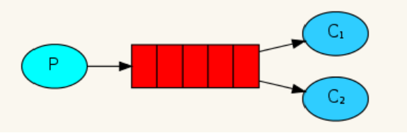

````
链接：https://pan.baidu.com/s/1zMdR-i72ygQ2vM12_g6G4w 
提取码：swu7
````
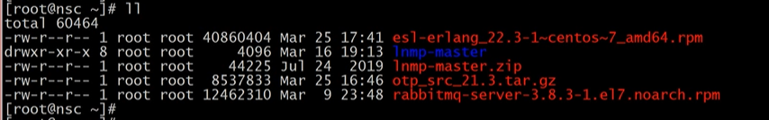

安装的顺序不能错

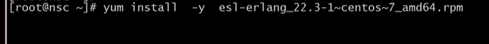

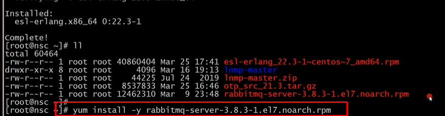

检测安装

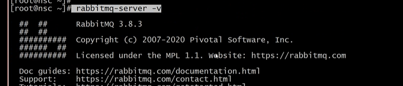

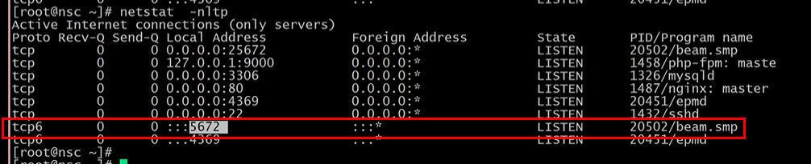

````
rabbitmq-server  -detached  启动
rabbitmqctl stop  停止
````

## 使用
命令:
````
(1) 新增一个用户
rabbitmqctl add_user Username Password

(2) 删除一个用户
rabbitmqctl delete_user Username

(3) 修改用户的密码
rabbitmqctl change_password Username Newpassword

(4) 查看当前用户列表
rabbitmqctl list_users

(5)赋予其administrator角色
rabbitmqctl set_user_tags   user_admin   administrator

(6) 给用户赋权限
rabbitmqctl  set_permissions -p vhost1 user1 '.*' '.*' ‘.*’

(7) 获取队列消息
rabbitmqctl list_queues 

````
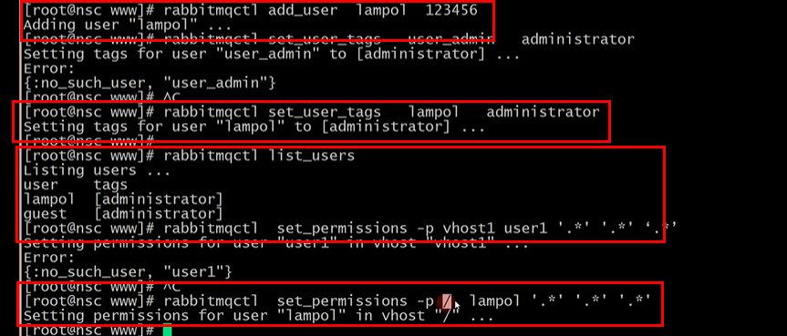

php使用,安装类库
````
composer require php-amqplib/php-amqplib
````
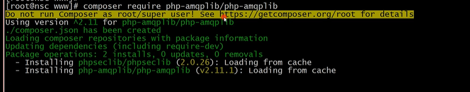

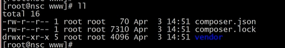

简答使用演示

send.php
````
<?php
require_once __DIR__ . '/vendor/autoload.php';
use PhpAmqpLib\Connection\AMQPStreamConnection;
use PhpAmqpLib\Message\AMQPMessage;

//默认的用户名密码: guest 
$connection = new AMQPStreamConnection('localhost', 5672, 'guest', 'guest');
//创建一个通道
$channel = $connection->channel();
//队列的名字,任意更改
$queue_name = 'shop';

$channel->queue_declare($queue_name, false, false, false, false);

$msg = new AMQPMessage(json_encode(['mobile'=>'138888888','goods_id'=>1]));
$channel->basic_publish($msg,'',$queue_name);


$channel->close();
$connection->close();
````
receive.php
````
<?php
require_once __DIR__ . '/vendor/autoload.php';
use PhpAmqpLib\Connection\AMQPStreamConnection;

$connection = new AMQPStreamConnection('localhost', 5672, 'guest', 'guest');
$channel = $connection->channel();

$queue_name = 'shop';

$channel->queue_declare($queue_name, false, false, false, false);


$callback = function ($msg) {
  echo $msg->body, "\n";
};

$channel->basic_consume($queue_name, '', false, true, false, false, $callback);

while ($channel->is_consuming()) {
    $channel->wait();
}

$channel->close ();
$connection->close ();
````
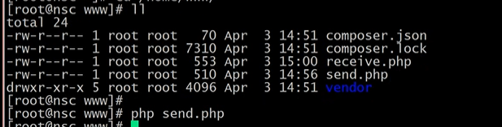

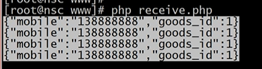

处于安全考略只能在本地去连接(localhost)

## 项目中使用
框架中引入 组件
````
composer require php-amqplib/php-amqplib
````
配置文件:
````
<?php

return [
	'rabbit-server'=>'127.0.0.1',
	'rabbit-port'=>5672,
	'rabbit-user'=>'guest',
	'rabbit-password'=>'guest',
	'rabbit-queue'=>'shop',

];
````
控制器中使用
````
<?php
namespace app\index\controller;

use think\Request;
use think\Controller;
use think\Db;
use PhpAmqpLib\Connection\AMQPStreamConnection;
use PhpAmqpLib\Message\AMQPMessage;

class Index extends Controller{

	private $start_time = 1585899574;
	private $redis;

	public function initialize (){
		$this->redis = new \Redis();
		$this->redis->connect('127.0.0.1',6379);	
	}

    public function index()
    {
		return view('index');
    }
	public function getTime(){
	//	if(!session('mobile')){
	//		return json(['status'=>'fail','msg'=>'先去登录']);;
	//	}
		$time = $this->start_time-time();
		return json(['time'=>$time]);	
	}


	public function getPath(Request  $request){

		if(!session('mobile')){
            return json(['status'=>'fail','msg'=>'先去登录']);
        }
		$now_time = time();
		if($now_time<$this->start_time){
			return json(['status'=>'fail','msg'=>'秒杀还没有开始']);
		}

		$ip = $request->server()['HTTP_X_FORWARDED_FOR'];
	
		if($this->redis->exists($ip)){
			if($this->redis->get($ip)>2){
				return json(['status'=>'fail','msg'=>'ip请求过多']);
			}			
			$this->redis->incr($ip);
		}else{		
			$this->redis->set($ip,1);		
		}
		$url = md5(session('mobile').$request->param('id'));
		
		$this->redis->set($url,1);  //1 为未访问  0访问 	
		// 这个地方 把地址 存到redis
		return json(['status'=>'success','url'=>$url]);	
	}

	public function order(Request $request){
		$url = $request->param('url');
		$id = $request->param('id');
		//http://www.lampol.vip/go/905635236f688eb6f0725a9512ced822/order/?id=1
		//echo $url.'===='.$id;
		
		if(!$this->redis->exists($url)){
			return json(['status'=>'fail','msg'=>'请求地址不合法']);
		}
		
		if(!$this->redis->get($url)){
			return json(['status'=>'fail','msg'=>'秒杀已经参加过了吧']);
		}		
		$this->redis->set($url,0);				
		
		$mobile = session('mobile');		
	//	$mobile = '13888888888';
		//  实际业务处理

		$goods_id = $this->redis->lpop('goods_id');
		
		if($goods_id){
			$this->redis->lpush('orders',$mobile.'=='.$goods_id);
			$this->sendOrder(json_encode(['mobile'=>$mobile,'goods_id'=>$goods_id]));
				
			return json(['status'=>'success','msg'=>'秒杀成功']);
		}else{
			return json(['status'=>'fail','msg'=>'秒杀失败']);
		}
		
	}	

	public function sendOrder($data){
		$connection = new AMQPStreamConnection(config('rabbitmq.rabbit-server'),config('rabbitmq.rabbit-port'), config('rabbitmq.rabbit-user'), config('rabbitmq.rabbit-password'));
		$channel = $connection->channel();
		
		$queue_name = config('rabbitmq.rabbit-queue');
		
		$channel->queue_declare($queue_name, false, false, false, false);
		
		$msg = new AMQPMessage($data);
		$channel->basic_publish($msg,'',$queue_name);
		
		
		$channel->close();
		$connection->close();		
	}

}
````
自定义命令``php think make:command Receive queue_recv
``
````
<?php

namespace app\command;

use think\console\Command;
use think\console\Input;
use think\console\Output;
use PhpAmqpLib\Connection\AMQPStreamConnection;
use think\Db;

class Receive extends Command
{
    protected function configure()
    {
        // 指令配置
        $this->setName('queue_recv');
        // 设置参数
        
    }

    protected function execute(Input $input, Output $output)
    {
    	// 指令输出
    	//$output->writeln('jhjjjjjjjj');
		$connection = new AMQPStreamConnection(config('rabbitmq.rabbit-server'),config('rabbitmq.rabbit-port'), config('rabbitmq.rabbit-user'), config('rabbitmq.rabbit-password'));
        $channel = $connection->channel();

        $queue_name = config('rabbitmq.rabbit-queue');	
	
		$channel->queue_declare($queue_name, false, false, false, false);
		
		
		$callback = function ($msg) {
		  $data = json_decode($msg->body,true);
		  Db::name('orders')->insert($data);
		};
		
		$channel->basic_consume($queue_name, '', false, true, false, false, $callback);
		
		while ($channel->is_consuming()) {
		    $channel->wait();
		}
		
		$channel->close ();
		$connection->close ();
		
    }
}
````

## 关于TP框架核laravel框架的对比
- TP:ThinkPhp简单、快速，基于MVC和面向对象，易用性较高，是一款简洁实用的轻量级框架。
- Laravel:Lavavel一直秉承着优雅的原则，很好的支持了composer，实现了更丰富的扩展，社区文档活跃，相较于TP，Lavavel更庞大，安全性也更高，更适合开发大中型项目，被称为“巨匠型开发框架”。
````
 1、提交数据的方式，Laravel在提交表单时需要在表单中加入{csrf_field}来防止跨域攻击，而TP不会。

 2、路由，Laravel必须先定义，再使用，路由文件为routes.php，
  哪怕没有控制器方法,只要写了路由就能够访问
TP在配置文件中开启路由后，路由格式是：'路由表达式' => '路由地址和参数'（使用路由的前提是URL支持phthinfo并且开启路由），路由可以使URL更符合SEO。

 3、中间件，Laravel的中间件，可以实现访问前后的处理,中间件就是HTTP请求到达之前经过的层，通过中间件我们可以验证用户是否登录等一些通用操作。

 4、操作数据库方式，都可以使用实例化（建立相对应的模型类）和DB:table('表名')来操作数据库，使用原生查询时不太相同，Laravel使用Db::操作('原生sql')，TP使用Db::query('原生sql')；

 5、Laravel升级十分简易，而TP大版本的升级要重构代码。
 6、渲染模版方式在Laravel框架里，使用return view()来渲染模版；而ThinkPHP里则使用了$this->display()的方式渲染模版
 7、条件判断语句书写方式

Laravel框架里 if else判断语句和foreach语句 书写时必须以@if开头 以@endif结尾,如果没有则报语法错误,@foreach @endforeach同理。

而TP框架则和PHP语法规则使用方式一致直接ifesle语句判断和foreach循环遍历
````